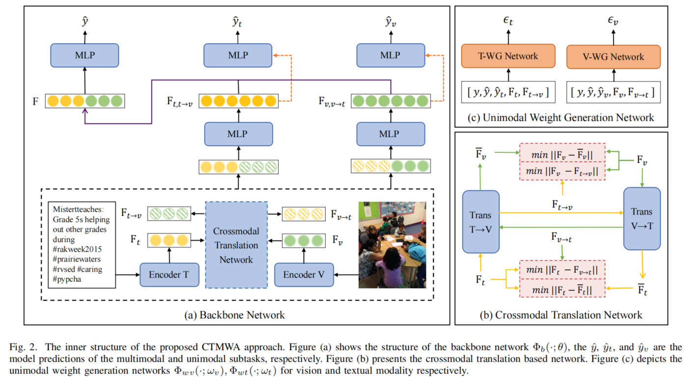

[](#License) [](https://thuiar.github.io/)

# CTMWA

> Pytorch implementation for codes in Crossmodal Translation based Meta Weight Adaption for Robust Image-Text Sentiment Analysis (Accepted by IEEE Transactions on Multimedia). 

## Motivation

> Image-Text Sentiment Analysis task has garnered increased attention in recent years due to the surge in user-generated content on social media platforms. Previous research efforts have made noteworthy progress by leveraging the affective concepts shared between vision and text modalities. However, emotional cues may reside exclusively within one of the prevailing modalities, owing to modality independent nature and the potential absence of certain modalities. In this study, we aim to emphasize the significance of modality-independent emotional behaviors, in addition to the modality-invariant behaviors. To achieve this, we propose a novel approach called Crossmodal Translation-Based Meta Weight Adaption (CTMWA).

<div align="center">

</div>

## Methodology - CTMWA

> This paper proposed an image-text sentiment classification method based on adaptive weight. The existing methods ignore the differences between image and text modal sentiment cues, mainly use object and scene detection tools to extract image information and match text words, and only mine shared information between images and text. The weight adaptation strategy can automatically calculate the degree of emotional cues between image and text modalities. Firstly, a small number of samples with single modal labels are used to guide the emotion prediction, and then the meta-learning strategy is combined to train the weight generation module. Finally, the modal weights of the image and text are dynamically assigned through the weight generation module. At the same time, the proposed method also introduces a cross-modal translation network. Even if a modality is missing, the translated unimodal representation can be used to replace the missing modality.



## Usage

1. Dataset Download.
    a. For MVSA-Single and MVSA-Multiple dataset, you need to download them Using the following link.

      - [MVSA](https://mcrlab.net/research/mvsa-sentiment-analysis-on-multi-view-social-data)

    b. For TumEmo dataset, you need to download them Using the following link.

      - [BaiduYun Disk](https://pan.baidu.com/s/1pzg3pSOaQ5rbJ89Ccl48mQ?pwd=zbrx) `code: zbrx`

      - [Google Drive](https://drive.google.com/drive/folders/1ZeI0mKZ_CkRc_iJPMF7tq20H6qmV93pw?usp=drive_link)
    
2. Model Reproduce. 
   ```python 
   bash train.sh
   ```